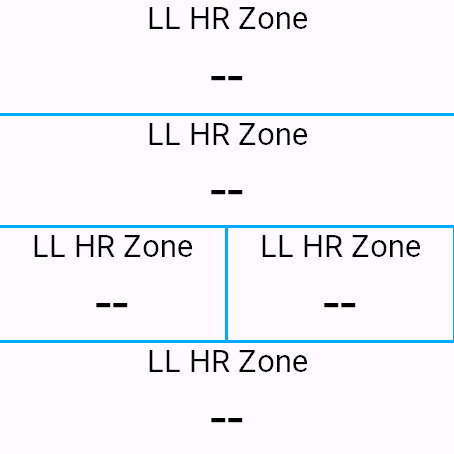

# Last Lap HR Zone

Connect IQ data field that displays the average heart rate zone index (0.0-6.0) from your last completed lap.

## Current Version

- `1.0.3` (2026-03-06)

## Garmin Connect IQ Store

- App page: <https://apps.garmin.com/apps/4e222e42-7b5e-401a-99a1-d221eea68bb6>





## What It Does

- Tracks heart rate samples during the current lap
- Computes average HR at lap event
- Converts average HR to decimal zone value (example: `3.4`)
- Displays `--` until the first lap is completed
- Optionally shows `LL HRZ` header text on taller layouts, with a setting to turn this on/off (default ON)
- Colors the displayed value by Garmin-style HR zone (1 gray, 2 blue, 3 green, 4 orange, 5 red), with a setting to turn this on/off (default ON)
- Resets values when the activity timer is reset

## Changelog

### 1.0.3 (2026-03-06)

- Adds an on-device setting to show or hide the `LL HRZ` header text (default ON)
- Updates supporting resources and simulator workflow assets for the new header-text option

### 1.0.2 (2026-03-05)

- Adds an on-device setting to enable or disable HR zone-based digit colors (default ON)
- Improves display readability with background-aware text coloring
- Documentation refresh for build/test and store submission materials

### 1.0.1 (2026-03-04)

- Initial public release of Last Lap HR Zone
- Displays the average heart rate zone of the last completed lap as a decimal value
- Uses profile-based heart rate zone boundaries from User Profile
- Adds broad device-target validation workflow with per-device pass/fail reporting

## Project Layout

- `LastLapHRZone/`: Connect IQ app source and resources
- `scripts/Test-ConnectIQDeviceMatrix.ps1`: multi-device compile test runner with pass/fail reports
- `store/`: Store submission drafts (description, release notes, privacy, screenshots checklist)

## Build and Test

### One-Time SDK Setup in VS Code

Inside `LastLapHRZone`, run the task:

- `Configure CIQ SDK + Key (once)`

### Build/Run Tasks

From workspace root, use **Terminal → Run Task**:

- `Device Matrix: Core`
- `Device Matrix: Manifest`
- `Device Matrix: Both`
- `Launch Simulator (Chosen Device)`

### Script Usage

From repo root:

```powershell
.\scripts\Test-ConnectIQDeviceMatrix.ps1 -DeveloperKeyPath .\developer_key.der -Mode Core
```

Reports are written to `LastLapHRZone/bin/device-tests/<timestamp>/`.

## Store Packaging Docs

- Listing copy: `store/STORE_LISTING.md`
- Release notes: `store/RELEASE_NOTES.md`
- Permissions and privacy: `store/PERMISSIONS_AND_PRIVACY.md`
- Screenshot checklist: `store/SCREENSHOTS.md`

## Permission Used

- `UserProfile` (to read HR zone boundaries from device profile)
